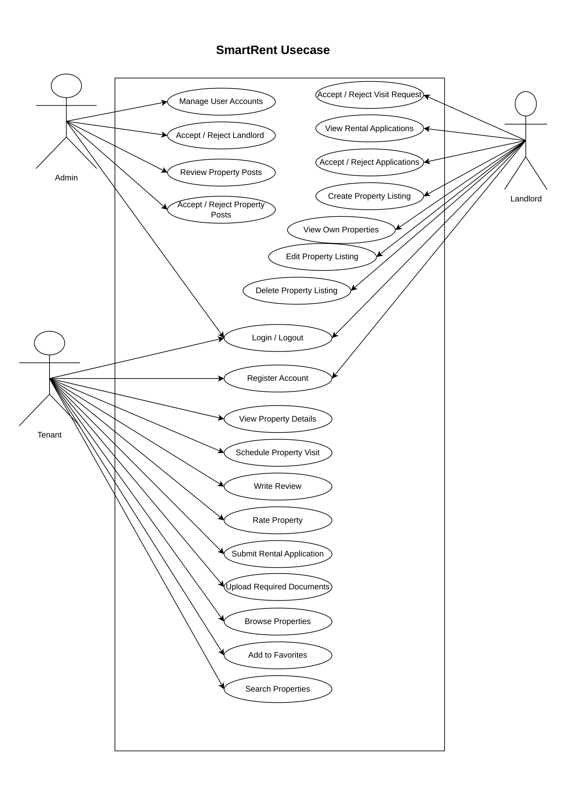
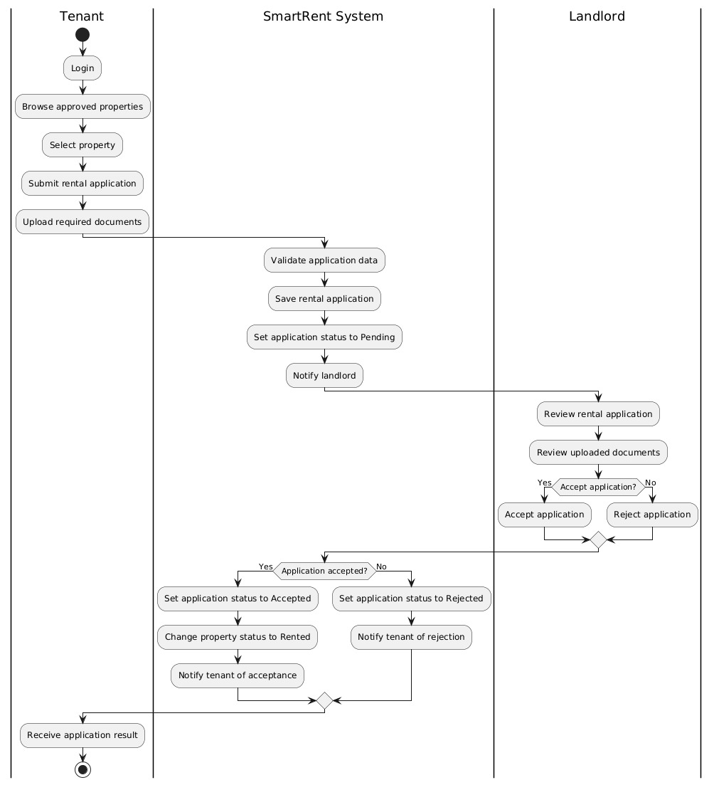
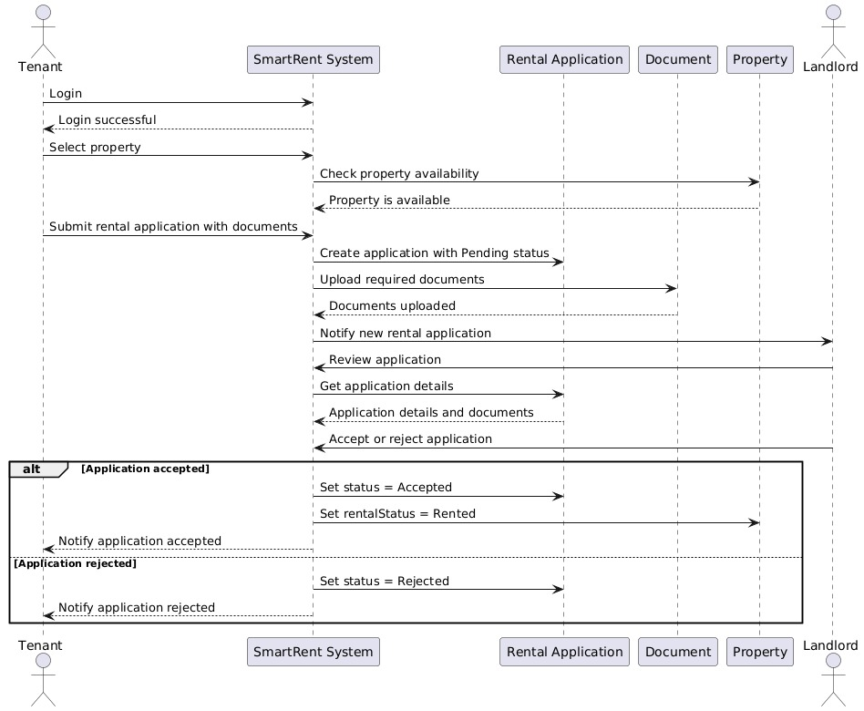
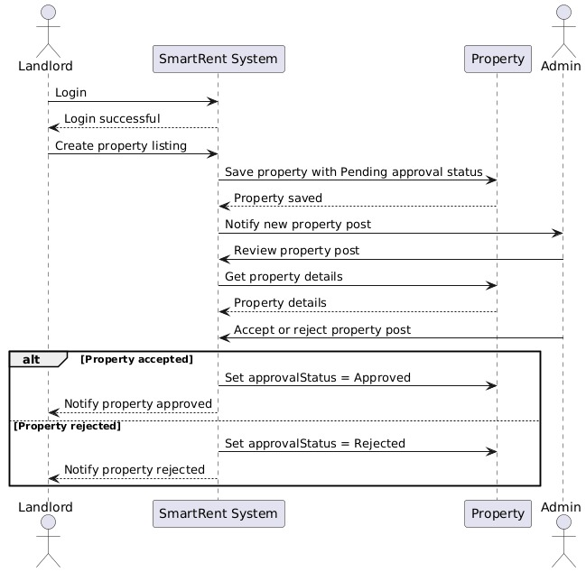
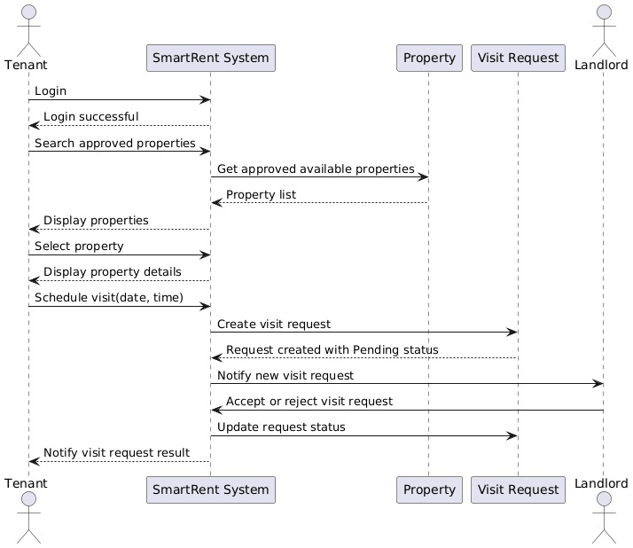
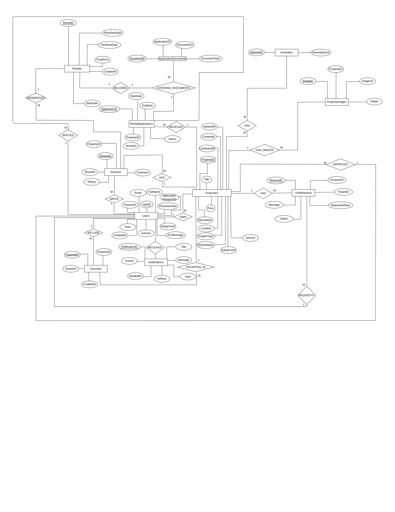
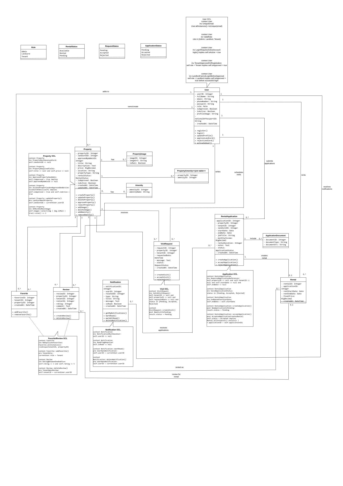

# Livora - Software Requirements Specification (SRS)

**Project:** Livora Property Rental Platform  
**Course:** Software Engineering 2  
**Version:** 1.1  
**Architecture:** React Frontend + Spring Boot Microservices + Spring Cloud Gateway + Eureka + Kafka + MySQL + Docker  

> Note: some internal folders/classes may still use the legacy project name `SmartRent`, but the user-facing platform name is **Livora**.

---

## Team Members

| Team Member Name | Student ID |
|---|---:|
| فاطمة صلاح الدين محمد | 20230399 |
| فاطمة أيمن أحمد | 20230397 |
| شهد خالد إبراهيم | 20230284 |
| بسملة أسامة شحات | 20230122 |
| ريهام أسامة إبراهيم | 20230225 |
| نورهان فهيم بسطا | 20220539 |

---

## Table of Contents

1. Introduction
2. Overall Description
3. System Users and Actors
4. Functional Requirements
5. Non-Functional Requirements
6. Use Cases
7. Behavioral Models: Activity and Sequence Diagrams
8. Data Model: Entity Relationship Diagram
9. Object Model: Class Diagram and OCL Constraints
10. External Interface and API Overview
11. System Architecture
12. Traceability Matrix
13. Assumptions, Constraints, and Acceptance Criteria

---

## 1. Introduction

### 1.1 Purpose

This Software Requirements Specification defines the requirements, scope, actors, functional behavior, non-functional quality attributes, diagrams, database model, class model, OCL constraints, APIs, and architecture for the **Livora** system.

The SRS is intended to be used as a reference for implementation, testing, validation, presentation, and project grading.

### 1.2 Scope

Livora is a web-based property rental platform that connects **tenants**, **landlords**, and **administrators**. It supports the complete rental workflow from property publishing to tenant application submission and landlord decision-making.

The system supports:

- User registration and authentication.
- Admin approval for landlord accounts.
- Admin approval for property posts.
- Property browsing, searching, and details.
- Property image and amenity management.
- Tenant favorites, reviews, and ratings.
- Visit request scheduling and landlord decisions.
- Rental application submission with uploaded document/image references.
- Rental creation after an accepted application.
- Notifications for important events.

### 1.3 Definitions and Acronyms

| Term | Definition |
|---|---|
| Tenant | A user who searches for rental properties, schedules visits, submits applications, and writes reviews. |
| Landlord | A user who creates property listings and manages tenant requests after admin approval. |
| Admin | A privileged user responsible for approving landlords and property posts. |
| JWT | JSON Web Token used for stateless authentication. |
| API Gateway | Single entry point that routes frontend requests to backend services. |
| Eureka | Spring Cloud service discovery server used by microservices to register and discover each other. |
| Kafka | Messaging platform used for asynchronous events and notifications. |
| OCL | Object Constraint Language used to define formal rules on model objects. |
| ERD | Entity Relationship Diagram describing the database structure. |
| DTO | Data Transfer Object used to transfer request/response data between frontend and backend. |

---

## 2. Overall Description

### 2.1 Product Perspective

Livora is a multi-role web application implemented using:

- React frontend.
- Spring Boot backend microservices.
- Spring Cloud Gateway.
- Eureka service discovery.
- Kafka-based event messaging.
- Docker containers and Docker Compose.
- MySQL database.

### 2.2 Major Product Functions

- User registration and authentication.
- Admin approval of landlords and property posts.
- Property browsing, searching, and detail viewing.
- Property listing management by landlords.
- Property image and amenity management.
- Visit request scheduling and decision management.
- Rental application submission and document/image attachment.
- Application acceptance/rejection and rental creation.
- Favorites, reviews, ratings, and notifications.

### 2.3 User Classes

| User Class | Main Responsibilities |
|---|---|
| Admin | Manage user accounts, approve/reject landlords, review property posts, approve/reject properties. |
| Landlord | Register, wait for admin approval, create property listings, manage own properties, view applications, accept/reject applications and visit requests. |
| Tenant | Browse/search properties, view details, add favorites, schedule visits, submit applications, upload documents, write reviews and ratings. |

---

## 3. System Users and Actors

| Actor | Description | Access Level |
|---|---|---|
| Admin | System supervisor responsible for approval and management workflows. | Full administrative access. |
| Landlord | Approved property owner who can list and manage rental properties. | Landlord-specific protected access. |
| Tenant | Regular user looking for rental properties. | Tenant-specific protected access. |
| Livora System | The software system that validates, stores, routes, and notifies. | Automated system actor. |

---

## 4. Functional Requirements

### 4.1 User and Authentication Requirements

| ID | Requirement |
|---|---|
| FR-1 | The system shall allow tenants and landlords to register using full name, email, phone number, password, role, and national/passport ID. |
| FR-2 | The system shall hash passwords before storing them. |
| FR-3 | The system shall auto-approve tenants after registration. |
| FR-4 | The system shall require admin approval before landlords can fully use landlord features. |
| FR-5 | The system shall allow approved and active users to login and receive an authentication token. |
| FR-6 | The system shall allow users to view and update their profiles. |
| FR-7 | The system shall allow admins to approve, reject, activate, or deactivate users. |

### 4.2 Property Management Requirements

| ID | Requirement |
|---|---|
| FR-8 | The system shall allow tenants and public users to browse approved and active properties. |
| FR-9 | The system shall allow property search by location, property type, and price range. |
| FR-10 | The system shall allow approved landlords to create, update, and delete/deactivate property listings. |
| FR-11 | The system shall set newly created properties to pending approval by default. |
| FR-12 | The system shall allow admins to approve or reject pending property posts. |
| FR-13 | The system shall allow landlords to add property images and amenities. |
| FR-14 | The system shall update a property rental status to Rented when a rental application is accepted. |

### 4.3 Rental Application and Visit Requirements

| ID | Requirement |
|---|---|
| FR-15 | The system shall allow tenants to create visit requests for approved properties. |
| FR-16 | The system shall allow landlords to accept or reject visit requests for their properties. |
| FR-17 | The system shall allow tenants to submit rental applications for available properties. |
| FR-18 | The system shall allow tenants to upload required application documents or image attachments as document URLs/references. |
| FR-19 | The system shall allow landlords to accept or reject rental applications. |
| FR-20 | The system shall automatically create a Rental record when an application is accepted. |

### 4.4 Engagement and Notification Requirements

| ID | Requirement |
|---|---|
| FR-21 | The system shall allow tenants to add and remove properties from favorites. |
| FR-22 | The system shall allow tenants to write reviews and ratings. |
| FR-23 | The system shall allow all users to view property reviews. |
| FR-24 | The system shall create notifications for key events such as approvals, visits, applications, and rentals. |
| FR-25 | The system shall allow users to mark notifications as read or delete them. |

---

## 5. Non-Functional Requirements

| ID | Category | Requirement |
|---|---|---|
| NFR-1 | Security | Passwords must be stored as secure hashes and never as plain text. |
| NFR-2 | Security | Protected endpoints must require valid authentication tokens. |
| NFR-3 | Authorization | Role-based access control must restrict admin, landlord, and tenant operations. |
| NFR-4 | Maintainability | Backend code should follow layered architecture: controller, service, repository, DTO, exception, configuration, security, and AOP layers. |
| NFR-5 | Scalability | Microservices should be independently deployable and scalable. |
| NFR-6 | Reliability | Events should be published for important state changes such as application acceptance and property approval. |
| NFR-7 | Observability | AOP logging should record method entry, exit, execution time, and errors. |
| NFR-8 | Portability | The system should run using Docker and Docker Compose. |
| NFR-9 | Usability | The frontend should provide clear flows for browsing, applying, reviewing, and managing requests. |
| NFR-10 | Performance | Common API requests should complete within acceptable response time under normal project load. |

---

## 6. Use Cases

The use case diagram summarizes the main interactions among Admin, Landlord, and Tenant actors.

**Figure 1. Livora Use Case Diagram**

### 6.1 Use Case List

| Use Case ID | Actor | Use Case |
|---|---|---|
| UC-1 | Tenant / Landlord | Register Account |
| UC-2 | User | Login / Logout |
| UC-3 | Tenant | Browse and Search Properties |
| UC-4 | Tenant | View Property Details |
| UC-5 | Tenant | Schedule Property Visit |
| UC-6 | Tenant | Submit Rental Application |
| UC-7 | Tenant | Upload Required Documents |
| UC-8 | Tenant | Add to Favorites |
| UC-9 | Tenant | Write Review and Rate Property |
| UC-10 | Landlord | Create/Edit/Delete Property Listing |
| UC-11 | Landlord | View and Accept/Reject Applications |
| UC-12 | Landlord | Accept/Reject Visit Request |
| UC-13 | Admin | Manage User Accounts |
| UC-14 | Admin | Accept/Reject Landlord |
| UC-15 | Admin | Accept/Reject Property Posts |

### 6.2 Detailed Use Case: Submit Rental Application

| Field | Description |
|---|---|
| Primary Actor | Tenant |
| Supporting Actors | Landlord, Livora System |
| Preconditions | Tenant is authenticated; selected property is approved and available. |
| Main Flow | Tenant selects a property, fills application details, uploads documents/image attachment, and submits. The system validates data, saves the application with Pending status, and notifies the landlord. |
| Alternative Flow | If required data or documents are missing, the system returns a validation error and does not save the application. |
| Postconditions | A pending rental application exists and the landlord receives a notification. |

### 6.3 Detailed Use Case: Approve Property Post

| Field | Description |
|---|---|
| Primary Actor | Admin |
| Supporting Actors | Landlord, Livora System |
| Preconditions | Landlord created a property listing with pending approval status. |
| Main Flow | Admin reviews the property details and accepts or rejects the post. |
| Alternative Flow | If rejected, the property remains hidden from public browsing. |
| Postconditions | Property status is updated and landlord is notified. |

---

## 7. Behavioral Models: Activity and Sequence Diagrams

### 7.1 Activity Diagram: Rental Application Workflow

This activity diagram describes the end-to-end rental application decision flow from tenant submission to landlord decision and tenant notification.

**Figure 2. Rental Application Activity Diagram**

### 7.2 Sequence Diagram: Rental Application

This sequence diagram shows the interaction between the tenant, Livora system, rental application component, document component, property component, and landlord during application submission and decision-making.

**Figure 3. Rental Application Sequence Diagram**

### 7.3 Sequence Diagram: Property Approval

This sequence diagram shows how a landlord creates a property listing and how an admin reviews and approves or rejects the property post.

**Figure 4. Property Approval Sequence Diagram**

### 7.4 Sequence Diagram: Visit Request

This sequence diagram shows the tenant browsing approved properties, selecting a property, creating a visit request, and receiving the landlord decision.

**Figure 5. Visit Request Sequence Diagram**

---

## 8. Data Model: Entity Relationship Diagram

The ERD defines the database entities, attributes, and cardinalities used by Livora. It includes Users, Properties, VisitRequests, RentalApplications, ApplicationDocuments, Rentals, Favorites, Reviews, Notifications, PropertyImages, Amenities, and PropertyAmenities.

**Figure 6. Livora Entity Relationship Diagram**

### 8.1 Entities and Purpose

| Entity | Purpose |
|---|---|
| Users | Stores Admin, Landlord, and Tenant account information. |
| Properties | Stores rental property data, approval flags, rental status, and landlord ownership. |
| RentalApplications | Stores tenant application data and application status. |
| ApplicationDocuments | Stores URLs/references and types of documents/images attached to applications. |
| Rentals | Stores confirmed rental records after application acceptance. |
| VisitRequests | Stores tenant requests to visit a property. |
| Favorites | Stores tenant-property favorite relationships. |
| Reviews | Stores tenant ratings and comments. |
| Notifications | Stores system messages delivered to users. |
| Amenities / PropertyAmenities | Stores amenity options and the many-to-many property amenity relationship. |
| PropertyImages | Stores property image URLs and main-image flag. |

---

## 9. Object Model: Class Diagram and OCL Constraints

The class diagram defines the main classes, attributes, operations, enumerations, relationships, multiplicities, and embedded OCL constraints for the Livora domain model.

**Figure 7. Livora Class Diagram with OCL Constraints**

### 9.1 Key Classes

| Class | Description |
|---|---|
| User | Represents Admin, Landlord, and Tenant users. |
| Property | Represents a rental property listing. |
| RentalApplication | Represents a tenant application for a property. |
| VisitRequest | Represents a scheduled property visit request. |
| Rental | Represents a confirmed rental after application acceptance. |
| Favorite | Represents a tenant favorite property. |
| Review | Represents a tenant review and rating. |
| Notification | Represents system-generated user notifications. |
| PropertyImage | Represents a property image. |
| Amenity | Represents a property amenity. |
| ApplicationDocument | Represents a document or image attached to an application. |

### 9.2 OCL Constraints Summary

| Area | Example Constraint |
|---|---|
| User | Emails must be unique; role must be Admin, Landlord, or Tenant; active account is required for login; landlord cannot login before approval. |
| Property | A property must have a landlord; title and price are required; approved property must have an approving admin; visible properties must be approved and active; at most one main image is allowed. |
| RentalApplication | Property, tenant, start date, and end date are required; status must be Pending, Accepted, or Rejected; end date must be after start date; accepted application creates a rental. |
| VisitRequest | Tenant, property, requested date, and valid status are required; new visits start as Pending. |
| Favorite | A tenant cannot add the same property to favorites more than once; favorites are tenant-only. |
| Review | Rating must be between 1 and 5; tenant can delete only their own review. |
| Notification | Notification must belong to a user; read flag must be defined; only owner can mark/delete notification. |

---

## 10. External Interface and API Overview

All frontend requests are routed through the API Gateway using the `/api` prefix. The following table summarizes the main public and protected API groups.

| Module | Representative Endpoints | Access |
|---|---|---|
| Authentication | `POST /api/auth/register`, `POST /api/auth/login` | Public |
| Users | `GET /api/users/me`, `PUT /api/users/me`, `GET /api/users`, approve/reject landlord | Authenticated / Admin |
| Properties | `GET /api/properties`, `GET /api/properties/search`, `POST /api/properties`, approve/reject property | Public / Landlord / Admin |
| Visits | `POST /api/visits`, `GET /api/visits/my`, accept/reject visit | Tenant / Landlord |
| Applications | `POST /api/applications`, upload documents, accept/reject application | Tenant / Landlord |
| Rentals | `GET /api/rentals/my`, `GET /api/rentals/landlord` | Tenant / Landlord |
| Engagement | Favorites, reviews, notifications | Tenant / Authenticated |

---

## 11. System Architecture

Livora uses a microservices architecture with a single frontend and several backend services. The API Gateway centralizes routing and token checks, while backend services own functional domains. Eureka provides service discovery, and Kafka enables asynchronous notification and state-change events.

| Component | Responsibility |
|---|---|
| React Frontend | Provides the user interface for tenants, landlords, and admins. |
| API Gateway | Routes requests to backend services and performs gateway-level JWT checks. |
| User/Auth Service | Handles registration, login, profile, user approval, and role operations. |
| Property Service | Handles property listing, images, amenities, approval, and rental status updates. |
| Rental/Booking Service | Handles visit requests, rental applications, documents, and rental creation. |
| Engagement/Notification Service | Handles favorites, reviews, and event-driven notifications. |
| Eureka Server | Provides service discovery. |
| Kafka | Transfers domain events between services. |
| MySQL Database | Stores persistent data. |
| Docker Compose | Runs services, database, Kafka, Eureka, gateway, and frontend containers. |

---

## 12. Traceability Matrix

| Requirement Group | Related Use Cases | Related Diagrams |
|---|---|---|
| User/Auth | UC-1, UC-2, UC-13, UC-14 | Use Case Diagram; Class Diagram |
| Property Management | UC-3, UC-4, UC-10, UC-15 | Use Case Diagram; Property Approval Sequence; ERD; Class Diagram |
| Visit Requests | UC-5, UC-12 | Visit Request Sequence; ERD; Class Diagram |
| Rental Applications | UC-6, UC-7, UC-11 | Rental Application Activity; Rental Application Sequence; ERD; Class Diagram |
| Favorites and Reviews | UC-8, UC-9 | Use Case Diagram; ERD; Class Diagram |
| Notifications | UC-5, UC-6, UC-10, UC-11, UC-15 | Sequence Diagrams; ERD; Class Diagram |

---

## 13. Assumptions, Constraints, and Acceptance Criteria

### 13.1 Assumptions

- Admin account exists or is seeded before system use.
- Landlords cannot publish visible properties until approved by admin.
- Images and documents are stored as URLs or encoded references depending on the implementation.
- A property must be approved and active before tenants can apply or request visits.
- The project environment uses Docker for local deployment.

### 13.2 Constraints

- The system is designed for academic project scope.
- Kafka and MySQL run locally through Docker Compose.
- Cloud support is represented through Spring Cloud components such as Gateway and Eureka.
- Actual public cloud deployment is outside the minimum scope unless required by the evaluator.

### 13.3 Acceptance Criteria

- All main actors can perform their key workflows successfully.
- Admin approval workflows correctly update user and property states.
- Rental applications are saved as Pending and can be accepted or rejected by landlords.
- Accepted applications create rentals and change property status to Rented.
- The ERD, class diagram, use case diagram, activity diagram, sequence diagrams, and OCL constraints are documented in this SRS.
- The implementation supports Dockerized execution and microservice communication.

---

## Appendix A. Included Diagram Files

The following diagram files are included in `docs/diagrams`:

- `use-case-diagram.png`
- `rental-application-activity.png`
- `rental-application-sequence.png`
- `property-approval-sequence.png`
- `visit-request-sequence.png`
- `erd.png`
- `class-diagram-ocl.png`

Original uploaded PDF/JPEG sources are preserved under:

- `docs/diagrams/originals/`
